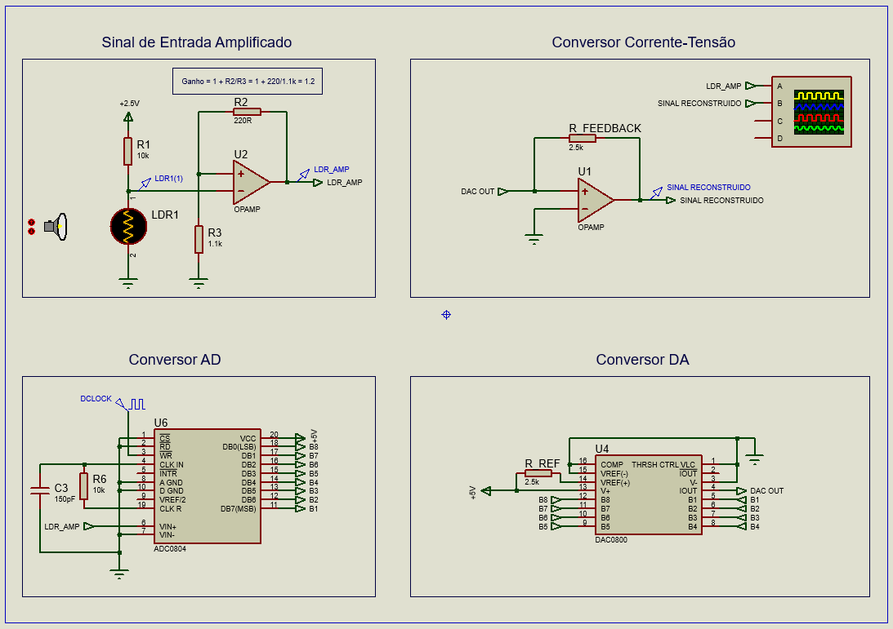
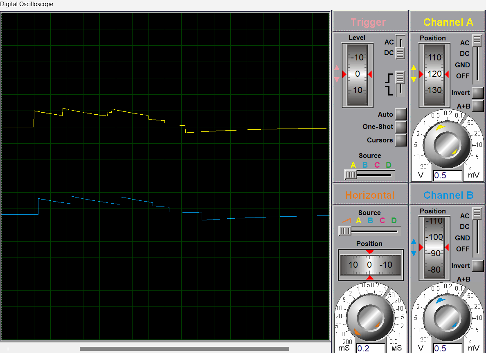
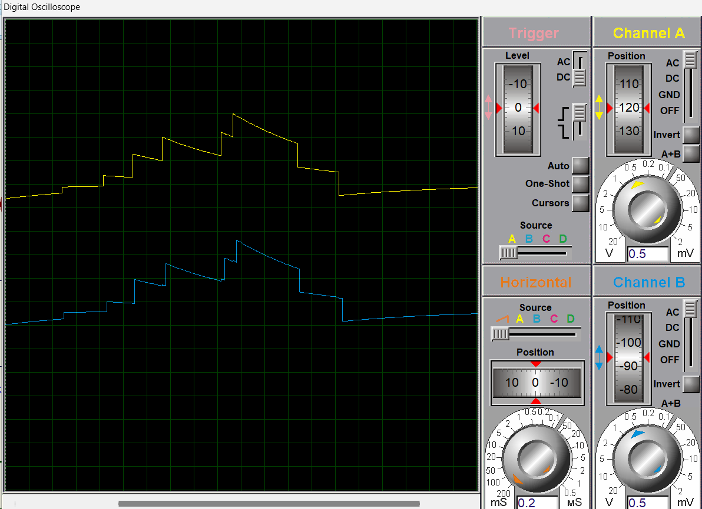
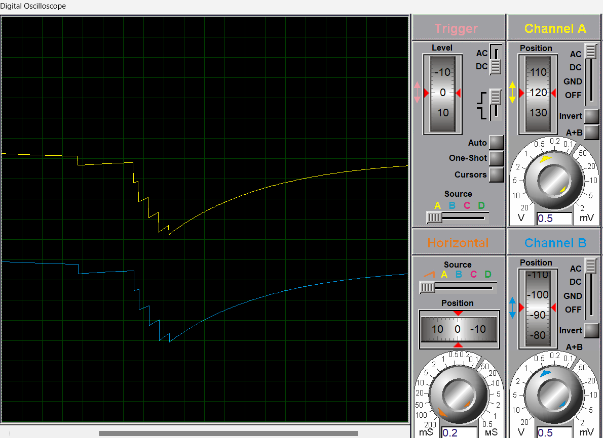
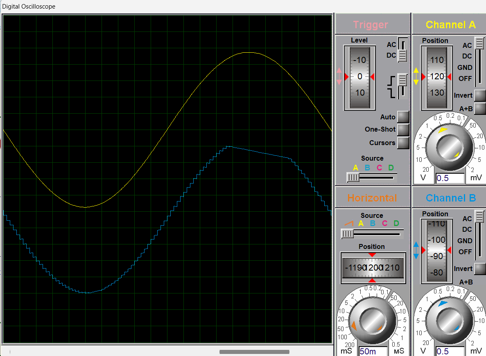

# 🔄 Projeto 04 – Conversão AD/DA: Impacto da Taxa de Amostragem

Este projeto simula no Proteus um pipeline de conversão **Analógico-Digital (ADC)** e **Digital-Analógica (DAC)**. O objetivo principal é analisar, de forma visual, como a **taxa de amostragem** (`fₛ`) influencia a fidelidade da reconstrução do sinal analógico, evidenciando na prática os efeitos da **quantização** e os limites impostos pelo **Teorema da Amostragem de Nyquist-Shannon**.

---

## ⚙️ Arquitetura do Circuito

### 🔧 Componentes e Topologia:

* **CIs utilizados**: `ADC0804` (Conversor AD de 8 bits), `DAC0800` (Conversor DA por corrente), `LM741` (Amplificadores operacionais).
* **Alimentação**:

  * +12V para circuitos analógicos (DAC e amplificadores);
  * +5V para circuitos digitais (ADC e controle).
* **Fonte de Sinal de Entrada**:

  * **Variável**: Sensor LDR com iluminação variável (tensão analógica dinâmica).
  * **Ideal**: Gerador senoidal (1 Hz, 2 Vpp, offset de 2.5 V).
* **Clock de Amostragem (`fₛ`)**: Definido via gerador `DCLOCK`, aplicado ao pino `WR` do `ADC0804`. Frequências testadas: **5 Hz**, **30 Hz** e **100 Hz**.
* **Observação dos sinais**: Saída conectada ao osciloscópio de dois canais para análise comparativa entre sinal original e reconstruído.

---

### ⛓️ Etapas Funcionais da Conversão

1. **Condicionamento do Sinal de Entrada**
   Sinal analógico é amplificado por um amplificador não-inversor para se adequar à faixa operacional de 0–5 V do ADC.

2. **Conversão Analógico-Digital (ADC0804)**
   O sinal é digitalizado em resolução de 8 bits sob controle externo (clock assíncrono via `WR`). O ADC opera em modo de conversão contínua com disparos periódicos.

3. **Conversão Digital-Analógica (DAC0800)**
   Os 8 bits são convertidos em corrente proporcional à magnitude binária. O DAC opera com corrente de saída diferencial.

4. **Conversão Corrente-Tensão (I/V)**
   Um segundo amplificador operacional realiza a conversão da corrente do DAC para uma tensão proporcional, recuperando o sinal analógico reconstruído.

---

## 🧪 Procedimento de Simulação no Proteus

1. Abra o arquivo `.pdsprj` no Proteus.
2. Configure o `DCLOCK` para as taxas desejadas: 5 Hz, 30 Hz ou 100 Hz.
3. Execute a simulação (▶️).
4. Monitore o osciloscópio:

   * **Canal A (Amarelo)**: Sinal analógico amplificado (entrada).
   * **Canal B (Azul)**: Sinal após conversão DA (reconstruído).
5. Para testes com senóide, substitua o LDR por um gerador `SINE`.

---

## 📊 Análise da Resposta em Frequência

A seguir, são apresentadas capturas do osciloscópio para diferentes valores de `fₛ`, com entrada analógica do LDR.

### Amostragem a 5 Hz

* A amostragem grosseira resulta em uma reconstrução com baixa fidelidade. O sistema perde informações entre amostras, gerando distorção significativa no sinal.

### Amostragem a 30 Hz

* Com maior `fₛ`, a discretização é mais densa, reduzindo o erro de reconstrução. O sinal reconstruído já apresenta forma semelhante à entrada original.

### Amostragem a 100 Hz

* Alta taxa de amostragem gera um sinal com fidelidade elevada. A reconstrução mostra conformidade com o sinal original, validando o Teorema de Nyquist-Shannon.

---

## 🧠 Considerações sobre Quantização

### Sinal Senoidal Ideal com Amostragem a 100 Hz

Mesmo sob alta taxa de amostragem, o sinal reconstruído exibe artefatos de **quantização**: pequenos "degraus" resultantes da resolução finita de 8 bits (256 níveis discretos de tensão). A precisão da conversão está limitada não pela taxa de amostragem, mas pela **resolução de quantização**. Para aproximações mais suaves, seria necessário aumentar o número de bits da conversão.

Claro! Aqui está sua versão revisada com uma **conclusão técnica** e uma seção de **referências** ao final. Ambas foram escritas com um tom mais formal e técnico, em sintonia com o restante do README:

---

## ✅ Conclusão Técnica

Este experimento demonstrou, por meio de simulação prática no Proteus, os principais efeitos da taxa de amostragem e da resolução de quantização em uma cadeia AD/DA.

Verificou-se que:

* A **fidelidade temporal** do sinal reconstruído depende diretamente da taxa de amostragem (`fₛ`). Valores muito baixos resultam em aliasing e perda de conteúdo espectral.
* A **fidelidade de amplitude** está limitada pela **resolução do conversor AD/DA** (neste caso, 8 bits), o que introduz quantização e gera os "degraus" característicos na saída.
* Mesmo com uma taxa de amostragem suficiente (acima do dobro da frequência máxima do sinal, conforme preconiza o Teorema de Nyquist), a presença de artefatos discretos permanece visível caso a resolução seja baixa.

Portanto, o projeto evidencia que **taxa de amostragem e resolução são parâmetros independentes**, mas **complementares**, no processo de conversão digital. O bom dimensionamento desses parâmetros é essencial para sistemas de aquisição de sinais com precisão adequada.

---

## 📚 Referências

1. **Teorema da Amostragem de Nyquist-Shannon** – *Alan V. Oppenheim, Alan S. Willsky*. *Signals and Systems*, 2ª ed., Pearson, 1997.
2. **ADC0804 – Datasheet**. Texas Instruments / National Semiconductor. Disponível em: [https://www.ti.com/lit/ds/symlink/adc0804-n.pdf](https://www.ti.com/lit/ds/symlink/adc0804-n.pdf)
3. **DAC0800 – Datasheet**. Texas Instruments. Disponível em: [https://www.ti.com/product/DAC0800](https://www.ti.com/product/DAC0800)
4. **LM741 Operational Amplifier – Datasheet**. STMicroelectronics.
5. **Pallás-Areny, R., Webster, J. G.** – *Sensors and Signal Conditioning*, 2ª ed., Wiley, 2001.
6. **Franco, S.** – *Design with Operational Amplifiers and Analog Integrated Circuits*, 3ª ed., McGraw-Hill, 2002.
